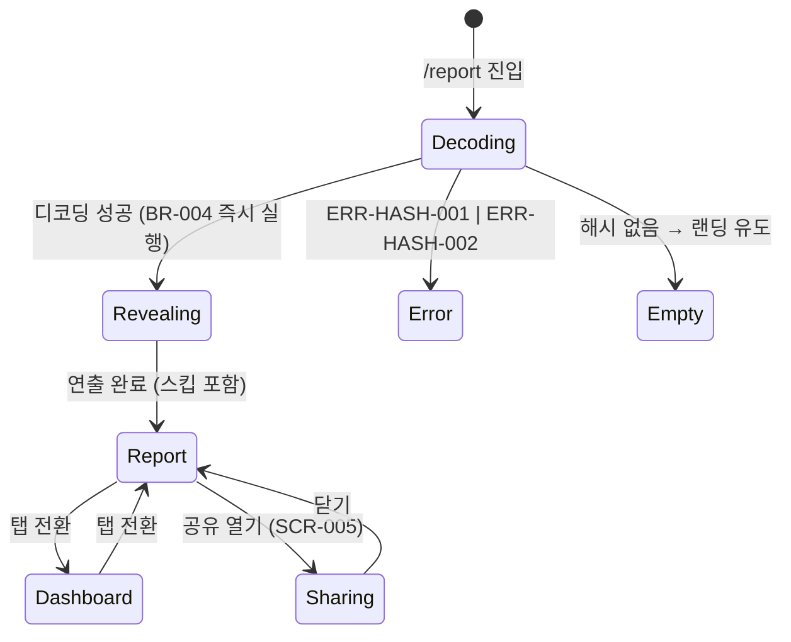

# 08 도메인규칙·상태전이

## 도메인 규칙 (BR)

| BR-ID | 규칙 | 강제 지점 | 에러 |
|---|---|---|---|
| BR-001 | 유형·등급·유머 문구 판정은 **웹**에서 수행. CLI는 원시 집계만 (CLI 재배포 없이 규칙·문구 수정 가능). **부작용 통제(2026-08-16)**: 웹 판정이므로 이미 공유된 링크의 유형·등급이 사후 변경될 수 있음 → 판정 규칙·등급 커브 변경은 **판정일 이후(v2)에만**, v1.x 기간엔 유머 문구만 수정(등급 불변). 규칙을 바꿔야 하면 페이로드 `v`를 올리고 구버전 링크는 ERR-HASH-002 흐름으로 재생성 안내. 사용자 고지는 CPY-COM-003(SCR-006) | 웹 판정 모듈 (`/tdd` 필수 대상 — PLAN) | — |
| BR-002 | `stats.sessions < 3` → 데이터 부족 모드: 유형·등급 미판정, 있는 지표만 표시 + 안내 | SCR-003·004 렌더링 진입부 | ERR-DATA-001 |
| BR-003 | `payload.v` > 웹 지원 버전 → 구버전 안내. 디코딩·파싱 실패 → 손상 안내 | `/report` 해시 디코더 | ERR-HASH-002 / ERR-HASH-001 |
| BR-004 | 발췌 포함 해시로 진입 시 즉시 `history.replaceState`로 주소창에서 발췌 제거(데이터는 메모리 유지). 발췌 포함 공유 URL은 SCR-005에서 명시적 토글 ON 후에만 생성 | `/report` 진입 코드 + SCR-005 URL 생성기 | — |
| BR-005 | 발췌는 최대 3개·각 200자 이내. 자격증명 패턴(`sk-`, `ghp_`, `AKIA`, `-----BEGIN`, `Bearer ` — 이 목록이 SSOT, 추가 시 여기만) 감지 시 해당 발췌 제외. 선별 순서는 CLI-001 §4 | CLI 발췌 선별기 (F-007, CLI-001) | — |
| BR-006 | OG 쿼리에는 유형·등급·요약 스탯만. 발췌·원문·경로명 금지 | SCR-005 OG URL 생성 코드 | — |
| BR-007 | 재미 장치는 SCR-002 공개 연출 1개뿐. 두 번째 재미 장치는 구현 금지 → backlog | 코드 리뷰 (PLAN 실패 조건 11) | — |
| BR-008 | 판정·집계 로직(유형 판정, 등급 계산, 지표 집계)은 `/tdd` 필수 — 테스트가 유일한 명세 | Day 4~9 구현 | — |

## 상태전이 (`/report` 결과 페이지)

DB 없음 — 클라이언트 상태 머신만 존재 (enum 1:1 검사 해당 없음).

계산 규칙(유형 판정식·등급 커브)은 Day 7 콘텐츠 제작일에 이 문서에 추가 확정 (OQ-001·OQ-002).
