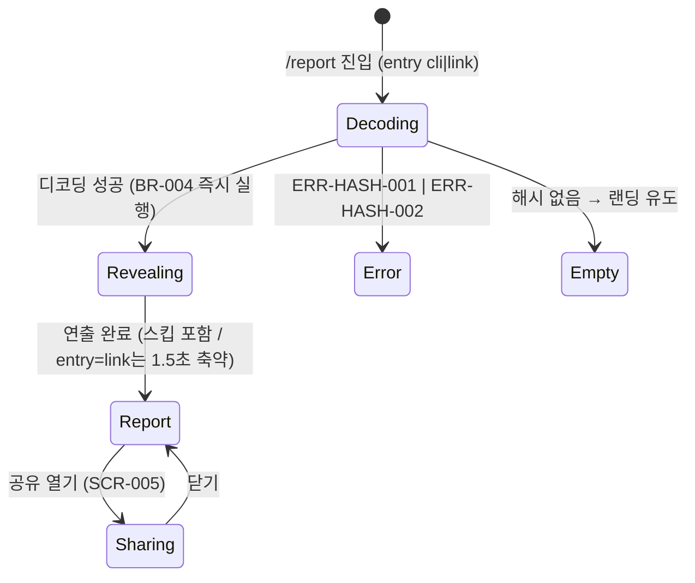

# 08 도메인규칙·상태전이

## 도메인 규칙 (BR)

| BR-ID | 규칙 | 강제 지점 | 에러 |
|---|---|---|---|
| BR-001 | 유형·등급·유머 문구 판정은 **웹**에서 수행. CLI는 원시 집계만 (CLI 재배포 없이 규칙·문구 수정 가능). **부작용 통제(2026-08-16)**: 웹 판정이므로 이미 공유된 링크의 유형·등급이 사후 변경될 수 있음 → 판정 규칙·등급 커브 변경은 **판정일 이후(v2)에만**, v1.x 기간엔 유머 문구만 수정(등급 불변). 규칙을 바꿔야 하면 페이로드 `v`를 올리고 구버전 링크는 ERR-HASH-002 흐름으로 재생성 안내. 사용자 고지는 CPY-COM-003(SCR-006) | 웹 판정 모듈 (`/tdd` 필수 대상 — PLAN) | — |
| BR-002 | `stats.prompts < 10` → 데이터 부족 모드: 유형·등급 미판정, 있는 지표만 표시 + 재실행 유도 안내 (2026-08-16: 하루 단위라 세션 수 조건 삭제) | SCR-003·004 렌더링 진입부 | ERR-DATA-001 |
| BR-003 | `payload.v` > 웹 지원 버전 → 구버전 안내. 디코딩·파싱 실패 → 손상 안내 | `/report` 해시 디코더 | ERR-HASH-002 / ERR-HASH-001 |
| BR-004 | 진입 시 즉시 `history.replaceState`로 주소창에서 하이라이트와 `?from=cli` 쿼리 제거(데이터는 메모리 유지). 하이라이트 포함 공유 URL은 SCR-005에서 명시적 토글 ON 후에만 생성 | `/report` 진입 코드 + SCR-005 URL 생성기 | — |
| BR-005 | 하이라이트는 **최다 사용 문장 ≤3(각 ≤100자, 반복 ≥2회)·단어 ≤10** — 원문 인용 아님(집계). 자격증명 패턴(`sk-`, `ghp_`, `AKIA`, `-----BEGIN`, `Bearer ` — 이 목록이 SSOT, 추가 시 여기만) 감지 시 해당 하이라이트 제외. 선별 순서는 CLI-001 §4 | CLI 하이라이트 선별기 (F-007, CLI-001) | — |
| BR-006 | OG 쿼리에는 유형·등급·대상일·숫자 지표·도구명만(07 파라미터). 하이라이트(최다 문장 포함)·원문·경로명 금지 | SCR-005 OG URL 생성 코드 | — |
| BR-007 | 재미 장치는 SCR-002 공개 연출 1개뿐. 두 번째 재미 장치는 구현 금지 → backlog | 코드 리뷰 (PLAN 실패 조건 11) | — |
| BR-008 | 판정·집계 로직(유형 판정, 등급 계산, 지표 집계)은 `/tdd` 필수 — 테스트가 유일한 명세 | Day 4~9 구현 | — |
| BR-009 | **등급** = `stats.prompts`·`stats.tokens.in+out`·`stats.activeMinutes` 3지표를 각각 고정 임계 커브로 0~100 점수화 → 평균 → **S / A+ / A / B+ / B / C** 6단계. 활동량이 많을수록 상위(Readme Stats 은유). 색 없음(DESIGN). 임계값 표는 §계산 규칙 (2026-08-24 Day 7 확정 — 제작자 30일 로그 백분위 근거, Day 13 게릴라 로그 보정 예정. 보정은 런칭 전이라 BR-001 제약 밖). **임계값 산정 전제**: `stats.tokens`는 cache_read를 제외한 정의(05·CLI-001 §3, 2026-08-20 개정)를 쓴다 — 제외 전 값으로 임계를 잡으면 토큰 축이 세션 길이에 지배되어 '긴 세션 1회 = 최고 등급'으로 무너진다 | 웹 판정 모듈 | — |
| BR-010 | **오늘의 유형** = 6종 + 폴백 1: 새벽 배회자(`fun.nightRatio`≥0.4) / 에러의 늪 탐험가(`fun.maxErrorStreak`≥5) / "다시요" 장인(`fun.retryScore÷stats.prompts`≥0.7) / 장문 설교자(`avgLen`≥1500) / 한 줄 사령관(`oneLinerRatio`≥0.9) / 마라톤 러너(`activeMinutes`≥480) / 밸런스 코더(폴백). 각 지표를 임계 대비 비율로 정규화해 **최고점 1개** 채택, 동점은 위 순서, 전 지표 비율 <1이면 폴백. **매일 바뀌는 것이 의도**(대상일 하루 데이터만 사용). 이름·임계 2026-08-24 확정(§계산 규칙 근거), 유형 문구 풀은 11 CPY-TYPE-001~007 | 웹 판정 모듈 | — |
| BR-011 | **하루 경계·대상일**: 로컬 05:00 경계, 대상일 = 마지막 활동일(오늘 활동 있으면 오늘). 웹은 재계산하지 않고 `day`·`inProgress`를 신뢰 | CLI-001 §2 (CLI가 강제) | — |

## 상태전이 (`/report` 결과 페이지 — 한 스크롤 페이지, 2026-08-16 탭 제거)

DB 없음 — 클라이언트 상태 머신만 존재 (enum 1:1 검사 해당 없음).

Report 상태 안에서 상단 = SCR-003 스탯 카드, 하단 = SCR-004 대시보드 섹션(스크롤). EVT-DASH-001은 SCR-004 첫 섹션 노출 시 발화(세션당 1회).

## 계산 규칙 (2026-08-24 Day 7 확정 — BR-009·BR-010의 SSOT)

> 근거: 제작자 30일 로그(활동일 21일) 백분위. 구 임계는 avgLen≥200이 p25, oneLinerRatio≥0.7·retryRatio≥0.3이 p50 수준이라 장문 설교자가 21일 중 13일을 독식하고 폴백이 0회였다 → 신 임계(p75~p95선 정렬)에서 7유형 전부 등장(장문5·밸런스8·한줄3·에러늪2·다시요1·마라톤1·새벽1). **Day 13 게릴라 로그로 보정 예정** — 특히 avgLen은 제작자 로그의 붙여넣기 편향이 커서 외부 표본 검증이 필수.

### 등급 커브 (BR-009)

각 지표를 앵커 구간 선형 보간으로 점수화한다. 첫 앵커 이하는 (0,0)→첫 앵커 선형, 마지막 앵커 이상은 100.

| 지표 | 20점 | 40점 | 60점 | 80점 | 100점 |
|---|---|---|---|---|---|
| `stats.prompts` | 10 | 20 | 50 | 90 | 120 |
| `stats.tokens.in+out` | 40만 | 80만 | 250만 | 750만 | 1,500만 |
| `stats.activeMinutes` | 30 | 90 | 270 | 360 | 480 |

**등급** = 3점수 평균을 정수 반올림(표시 점수와 동일 값) 후: S ≥90 / A+ ≥75 / A ≥60 / B+ ≥45 / B ≥25 / C <25. (제작자 21일 검증 분포: C2·B5·B+2·A7·A+2·S3)

### 유형 판정식 (BR-010)

`ratio = 지표 ÷ 임계`를 6유형 각각 계산 (`retryRatio = fun.retryScore ÷ stats.prompts`, `avgLen`·`oneLinerRatio`는 `fun.promptStyle`). 최대 ratio가 ≥1이면 그 유형, 전부 <1이면 밸런스 코더. 완전 동점은 BR-010 나열 순서 우선.

**유형 코드** (07 `t` 값 — 표시명과 분리된 안정 식별자, v1.x 문구·이름 수정에도 불변):

| 코드 | 유형 | 코드 | 유형 |
|---|---|---|---|
| `night` | 새벽 배회자 | `one` | 한 줄 사령관 |
| `swamp` | 에러의 늪 탐험가 | `marathon` | 마라톤 러너 |
| `retry` | "다시요" 장인 | `balance` | 밸런스 코더 |
| `long` | 장문 설교자 | | |

### 유형 문구 선택 (EL-RPT-003)

유형별 문구 풀(11 CPY-TYPE-001~007, 각 2개)에서 `day`의 숫자합(YYYYMMDD 8자리 합) % 풀 크기 인덱스로 선택 — 동일 입력 = 동일 결과 (TC-RPT-001-01 결정성).
